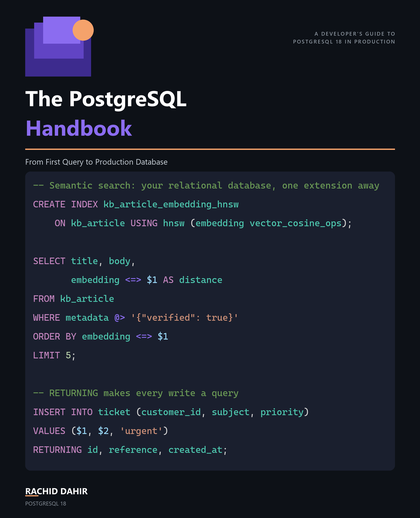

# The PostgreSQL Handbook

<p align="center">
  
</p>

<p align="center"><strong>From First Query to Production</strong></p>

<p align="center"><em>From your first SELECT to indexes, query plans, row-level security, backups, partitioning, and replication — every listing verified against a live PostgreSQL 18.4.</em></p>

<p align="center"><strong>📖 <a href="https://leanpub.com/thepostgresqlhandbook">Read it on Leanpub</a> — pay what you want.</strong></p>

<p align="center"><sub>The book itself ships through Leanpub, Payhip, and Amazon. This repository hosts the companion code, errata, and reader feedback.</sub></p>

---

## What's in this book

This book teaches **PostgreSQL** the way you will actually use it — through one running system, **Lumina Helpdesk**, a support-ticketing database that grows chapter by chapter from an empty schema into something with real constraints, real indexes, real roles, and a real replica.

Across five parts and twenty-three chapters you go from schema design and CRUD through relational thinking — joins, aggregation, subqueries and CTEs, window functions — into what makes PostgreSQL PostgreSQL: JSONB beside relational columns, full-text search, server-side functions and triggers, and MVCC concurrency explained without hand-waving. The back half is operations: indexes, EXPLAIN and query tuning, security and row-level security, backups and monitoring, partitioning, and streaming replication with connection pooling. The last three chapters connect it to application code — raw Npgsql, EF Core, and pgvector for semantic and hybrid search.

Every SQL listing in this repository is real, executable SQL. Each one runs against a live PostgreSQL 18.4 through an automated harness before it is allowed into the book, and the `psql` output printed under it is captured from that run — never typed by hand. The seed data is deterministic (a fixed random seed, a fixed timestamp anchor), so the rows you get on your machine are the rows in the book, in the book's order.

## Table of Contents

| # | Chapter | Part |
|---|---------|------|
| 1 | Why PostgreSQL, and Getting It Running | **I — Foundations** |
| 2 | Designing Lumina Helpdesk: Databases, Schemas, and Tables | I |
| 3 | CRUD: Inserting, Reading, Updating, Deleting | I |
| 4 | Filtering, Sorting, and Shaping Results | I |
| 5 | Data Types Done Right | I |
| 6 | Constraints: Making Bad Data Impossible | **II — Relational Thinking** |
| 7 | Joins: Reading Across Tables | II |
| 8 | Aggregation: From Rows to Answers | II |
| 9 | Subqueries and CTEs: Composing Queries | II |
| 10 | Window Functions: Analytics Without Leaving SQL | II |
| 11 | JSONB: Relational and Document, Together | **III — The PostgreSQL Difference** |
| 12 | Search: Pattern Matching and Full-Text | III |
| 13 | Server-Side Code: Views, Functions, Procedures, Triggers | III |
| 14 | Transactions and Concurrency: MVCC Without Tears | III |
| 15 | Indexes: The Right Tool for Each Shape of Question | **IV — Performance & Operations** |
| 16 | Reading the Planner's Mind: EXPLAIN and Query Tuning | IV |
| 17 | Security: Roles, Privileges, and Row-Level Security | IV |
| 18 | Backups, Maintenance, and Monitoring | IV |
| 19 | Partitioning: When One Table Isn't Enough | IV |
| 20 | Replication and Connection Pooling | IV |
| 21 | Talking to PostgreSQL from Code | **V — PostgreSQL in the Real World** |
| 22 | Gateway: PostgreSQL with EF Core | V |
| 23 | Gateway: PostgreSQL as an AI Database with pgvector | V |

Five appendices follow: a native installation guide, a psql survival guide, the SQL style guide every listing obeys, worked solutions to all 69 exercises, and a reference for what changed between PostgreSQL 16 and 18. A page-numbered index closes the book.

---

## Companion code

### Target stack

- **PostgreSQL 18.4**, natively installed or via the provided `pgvector/pgvector:pg18` Docker image
- **.NET 10** / **C# 14** for the three companion projects behind Chapters 21–23 (Npgsql, EF Core, pgvector)
- `psql` for everything else — no ORM, no framework, until Chapter 21

> The first twenty chapters need nothing but PostgreSQL itself and a terminal. This is a SQL-first book: the C# in Chapters 21–23 connects the fluency you've already built to your application, it doesn't teach C#.

### Quick start

```bash
docker compose up -d
./scripts/reset-to-chapter.sh 22        # macOS / Linux
.\scripts\reset-to-chapter.ps1 -Chapter 22    # Windows
```

That gives you the exact database every Chapter 1–22 listing was verified against. (States 20 and 22 are identical — no migration lands between them.) No Docker? Appendix A covers a native install; the scripts work identically against it, connecting via the standard `PGHOST` / `PGPORT` / `PGUSER` / `PGPASSWORD` environment variables (default `localhost:5432` as `postgres`).

**Chapter 23 (pgvector) is the one exception.** It needs the pgvector-enabled image specifically, and if you already have a native PostgreSQL install on the default port, `docker compose up -d` will collide with it. Give the container its own port and point the scripts at it:

```bash
$env:POSTGRES_PORT = '5433'
docker compose up -d
$env:PGPORT     = '5433'
$env:PGPASSWORD = 'lumina'
.\scripts\reset-to-chapter.ps1 -Chapter 23    # or: ./scripts/reset-to-chapter.sh 23
```

(Or stop your native server and skip the `PGPORT` overrides if you'd rather keep everything on 5432 — either works, just not both servers on the same port.)

### Clone

```bash
git clone https://github.com/RachidD68/the-postgresql-handbook.git
cd the-postgresql-handbook
```

### Run the verification harness

```powershell
.\tools\verify-listings.ps1 -Chapter 7
```

Runs every listing in Chapter 7 against a fresh `reset-to-chapter` state and checks output where the book declares `match`. This is the same harness every chapter was verified with before it shipped — 100% of non-skipped listings pass, and every listing meant to fail does so with the SQLSTATE the book names.

### Run a companion project

```bash
dotnet build src/LuminaHelpdesk.slnx
dotnet run --project src/Lumina.Search        # Chapter 23: pgvector hybrid search
```

### Repository layout

| Path | What it is |
|---|---|
| `docker-compose.yml` | PostgreSQL 18 (`pgvector/pgvector:pg18`) + pgAdmin — the Chapter 1 environment |
| `schema/` | `010-core-schema.sql` (Chapter 2, frozen once shipped) plus additive migrations, one per schema-changing chapter |
| `seed/` | Deterministic data: `seed-core.sql` (the 40 tickets the book narrates), `seed-bulk.sql` (80k tickets for the performance chapters) |
| `sql/chNN/` | **Generated** — every listing printed in chapter NN, exactly as printed. Do not edit; they are emitted from the book's own source |
| `sql/manifests/` | **Generated** — the listing manifest per chapter, kept in sync with the book at render time |
| `exercises/chNN/solutions/` | Worked solutions (basic / intermediate / challenge) for all 69 exercises |
| `scripts/` | `reset-to-chapter.ps1 -Chapter N` (Windows) / `reset-to-chapter.sh N` (macOS/Linux) — rebuild the database to the state chapter N expects |
| `tools/` | The verification harness (`verify-listings.ps1`) and the helpers it drives — output capture, output normalisation, and the two-connection runner Chapter 14 describes |
| `src/` | The three-project C# solution for Chapters 21–23: `Lumina.Data` (Npgsql), `Lumina.EfCore` (EF Core), `Lumina.Search` (pgvector) |
| `config/` | The planner settings the book's `EXPLAIN` output was captured under |

## Chapter state

Chapter state is a pure function of N: `reset-to-chapter.ps1 -Chapter N` (or `reset-to-chapter.sh N`) gives you the database as it stands when chapter N *opens* — the core schema (from Chapter 3 onward), every migration from earlier chapters, and the seeds N calls for, then `VACUUM (ANALYZE)`. The chapter's own DDL is yours to type as you follow along. If a listing from Chapter 9 misbehaves, reset to 9 — never assume state left over from other chapters.

## Determinism

Seeds use fixed ids, fixed timestamps (the book's "today" is `2026-01-15 09:00:00+00`), and prime-modulus arithmetic instead of `random()`, so your result grids match the book's byte for byte. The reset script pins `jit = off`, `work_mem`, and `random_page_cost` at the database level so your `EXPLAIN` output matches too.

## Errata & feedback

Spotted a listing that won't run, output that doesn't match, or a claim that's out of date? Please [open an issue](../../issues/new). Reader corrections are how the book gets better.

## License

- The **companion code** in this repository is released under the [MIT License](./LICENSE) — use it, fork it, build on it freely, including in commercial work.
- The **book text** is © 2026 Rachid Dahir. Published by AviSoft. All rights reserved, and distributed via [Leanpub](https://leanpub.com/thepostgresqlhandbook), Payhip, and Amazon.
